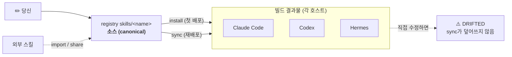

# my-skills

**Agent Skill을 한 번 작성하고, 모든 에이전트에서 사용하세요.**

_스킬을 위한 하나의 정규(canonical) 위치 — Claude Code·Codex·Hermes 전반에 설치·동기화·공유._

[English](README.md) | **한국어**

[](https://www.python.org/)
[](https://docs.astral.sh/uv/)
[](https://agentskills.io/specification)
[](LICENSE)

`my-skills`는 당신의 [Agent Skills](https://agentskills.io/specification)를
한곳에 보관하고, 같은 스킬을 사용하는 모든 AI 코딩 에이전트에 설치하는 작은
CLI입니다. 스킬을 한 번 편집하면 `sync`가 어디든 전파하며, 복사본이 변경(drift)됐을
때는 조용히 덮어쓰지 않고 알려줍니다.

## 왜 쓰나요

- **한 번 작성, 어디서든 실행** — 같은 스킬이 Claude Code·Codex·Hermes에서 동작합니다.
- **조용한 덮어쓰기 없음** — 설치는 기본적으로 복사하며, 건드리기 전에 로컬 편집(drift)을 감지합니다.
- **머신-로컬은 로컬에** — 비밀값·경로·계정은 정규 스킬이나 git에 절대 들어가지 않습니다.
- **CI 친화적** — `validate`, `install`, `sync --check`는 오류나 드리프트 시 비정상 종료코드를 반환합니다.

## 어떻게 동작하나요

### 하나의 도구, 두 개의 repo

tool repo(이 저장소)는 설치하는 대상입니다. registry(기본값
`~/my-agent-skills`, `init-registry`가 생성)는 실제 스킬이 사는 곳입니다.
이 저장소를 clone하는 것은 기여자를 위한 작업이며, clone 자체가 registry는
아닙니다.

스킬은 registry의 `skills/<name>/` 아래 디렉터리이며, YAML
frontmatter(`name`, `description`)를 가진 `SKILL.md`를 포함합니다 —
[Agent Skills](https://agentskills.io/specification) 표준입니다. registry의
`skills/` 디렉터리가 **정규(canonical)** 진실의 원천입니다.

각 에이전트(Claude Code, Codex, Hermes)는 **호스트**입니다. `install`은 정규
스킬을 호스트로 복사하고, `sync`는 그 복사본을 최신으로 유지합니다. 복사본은
제자리에서 편집될 수 있으므로, `my-skills`는 **드리프트**를 추적해 `sync`가 로컬
변경을 알리지 않고 덮어쓰는 일이 없도록 합니다.

registry의 `skills/`를 소스로, 각 호스트 복사본을 빌드 결과물로 생각하면 됩니다:



## 빠른 시작

요구 사항: **Python 3.11+** 와 [uv](https://docs.astral.sh/uv/).

GitHub에서 CLI를 설치한 뒤 private registry를 만듭니다:

```bash
uv tool install git+https://github.com/Seosiju/my-skills.git

my-skills init-registry        # 위치를 묻고, 기본값은 ~/my-agent-skills
my-skills doctor               # Registry 줄이 내 registry를 가리키는지 확인
my-skills install --dry-run    # seed된 기본 스킬 설치 계획 미리 보기
my-skills install              # 활성 스킬을 에이전트에 배포
```

`init-registry`는 public-safe 기본 스킬을 seed하고, 이 registry를 active root로
기록하며, `--no-git`을 주지 않으면 git도 초기화합니다. 이후 명령은 어느 디렉터리에서나
동작합니다:

```bash
my-skills doctor
my-skills skills --json
```

## CLI 업데이트

`my-skills doctor`는 더 최신 안정 CLI 릴리스가 있으면 알려줍니다. 업데이트는
자동으로 적용되지 않으며, 설치된 도구를 바꾸려면 명시적으로 update 명령을 실행합니다:

```bash
my-skills doctor
my-skills update
```

기본값은 최신 `vMAJOR.MINOR.PATCH` 릴리스 tag입니다. 실제 변경 없이 확인하려면:

```bash
my-skills update --check
my-skills update --dry-run
```

`main` 브랜치의 개발 빌드를 설치하려면:

```bash
my-skills update --channel main
```

`skills`는 모든 스킬과 호스트별 설치 위치를 보여줍니다:

```text
SKILL             ENABLED  CLAUDE   CODEX    HERMES
----------------  -------  -------  -------  -------
cli-inventory     yes      fresh    fresh    missing
personal-profile  yes      fresh    stale    missing
my-skills         yes      fresh    fresh    fresh
```

## 공개 CLI, 비공개 registry

이 repo는 두 역할을 합니다:

```text
github.com/Seosiju/my-skills
  공개 CLI 패키지
  공개 가능한 starter skills
  docs, tests, release automation

각자의 private registry
  my-skills.toml
  skills/<name>/SKILL.md
  개인/회사 맥락이 들어간 비공개 스킬

머신-로컬 data path
  실제 config.json 파일
  계정, 토큰, 메모리, local state
```

공개 repo는 도구 설치에 사용합니다. canonical skill에 개인·회사·머신별 맥락이
들어간다면 별도 private registry를 사용하세요. secret은 public repo와 private
repo 모두에 넣지 말고 `my-skills data-path <skill>` 아래에 둡니다.

private registry를 만듭니다. 경로를 생략하면 기본 위치는 `~/my-agent-skills`이며,
`init-registry`는 기본 public-safe 스킬을 seed하고 active root를 기록한 뒤
`git init`을 실행합니다:

```bash
uv tool install git+https://github.com/Seosiju/my-skills.git
my-skills init-registry
```

scaffold 구조:

```text
my-agent-skills/
├── my-skills.toml        # 호스트, 기본값, seed된 [skills.<name>] 항목
├── skills/               # seed된 기본 스킬을 포함한 canonical skills
├── .gitignore            # local override 무시
└── README.md             # private registry 운영 메모
```

빈 registry가 필요하면 `--no-defaults`를, git 없는 plain folder를 원하면 `--no-git`을
사용하세요. `bootstrap`은 이제 일반 첫 설정이 아니라 source checkout에서 기여/개발할 때
쓰는 경로입니다.

## 명령이 registry를 찾는 순서

대부분의 명령은 다음 순서로 registry를 찾습니다:

1. `MY_SKILLS_ROOT` 환경 변수. 한 번의 명령만 다른 registry로 실행할 때 씁니다.
2. 현재 디렉터리나 부모 디렉터리의 `my-skills.toml`. 이 호출에만 적용됩니다.
3. `init-registry` 또는 `set-root`가 기록한 cached active root.

다른 valid active root가 cache되어 있는 상태에서 또 다른 registry 안에서 명령을
실행하면, 그 명령은 현재 디렉터리를 사용하고 stderr에 안내를 출력합니다. active root를
조용히 바꾸지는 않습니다. 영구적으로 바꾸려면 다음을 실행하세요:

```bash
my-skills set-root /path/to/your/registry
my-skills doctor
```

아직 active root가 없는 머신에서는 편의를 위해 현재 디렉터리에서 처음 발견한
registry를 기록할 수 있습니다. 기여자용 clone에도 패키징과 테스트를 위한 seed
`skills/` 및 `my-skills.toml`이 있으므로, 실제 스킬을 변경하기 전에는
`my-skills doctor`의 `Registry:` 줄을 확인하세요.

첫 private skill을 추가합니다:

```bash
mkdir -p skills/my-private-skill
$EDITOR skills/my-private-skill/SKILL.md
```

그리고 `my-skills.toml`에 등록합니다:

```toml
[skills.my-private-skill]
enabled = true
hosts = ["claude", "codex", "hermes"]
```

agent host에 쓰기 전에는 항상 미리 봅니다:

```bash
my-skills validate
my-skills audit --all --json
my-skills install --dry-run
my-skills install
```

## 포함된 스킬

| 스킬 | 하는 일 |
|------|---------|
| `cli-inventory` | 이 머신에 설치된 CLI 도구를 발견(PATH + Homebrew/npm/pipx/cargo/gem/pip)해 머신-로컬 인벤토리로 기록하고 빠르게 다시 읽기. |
| `personal-profile` | 사용자에 대한 지속적인 사실(정체성, 선호)을 기억하고 에이전트 전반에 적용. |
| `my-skills` | 카탈로그·share·install·sync 워크플로를 CLI로 안내하는 에이전트용 스킬. |
| `my-jira` | 머신-로컬 설정 템플릿을 포함한 Jira/Atlassian 부트스트랩 스킬. 기본값은 비활성. |

## 일상 명령어

```bash
# 무엇이 있고 어디에 설치됐는지 본다.
my-skills skills              # 에이전트/UI용은 --json 추가
my-skills status              # 스킬별·호스트별 설치 상태

# 설치 / 갱신.
my-skills install --dry-run   # 계획만 미리 보기, 아무것도 안 씀
my-skills install             # 활성 스킬 -> 활성 호스트
my-skills install cli-inventory --host claude
my-skills install cli-inventory --host all --yes  # 명시적인 다중 호스트 쓰기
my-skills sync                # 정규 편집을 관리되는 설치본으로 전파
my-skills sync --check        # 드리프트만 감지 (fresh 아니면 비정상 종료코드)

# 관리되는 설치본 제거 (기록된 대상만).
my-skills uninstall cli-inventory --host claude

# 기본 install/sync 선택을 위해 스킬 켜기/끄기.
my-skills enable cli-inventory
my-skills disable cli-inventory
```

### 이미 작성한 스킬 가져오기

```bash
# 외부 스킬 디렉터리를 정규 skills/로 가져온다.
my-skills import ~/.hermes/skills/cli-inventory
my-skills enable cli-inventory
my-skills install cli-inventory --host <host>

# 또는 가져오면서 바로 활성 상태로 등록한다.
my-skills import ~/.hermes/skills/cli-inventory --enable

# 또는 호스트의 로컬 스킬을 검토한 뒤 하나를 my-skills로 승격한다.
my-skills share --from claude --plan --json
my-skills share --from claude cli-inventory --enable
my-skills sync cli-inventory
```

`import`는 스킬을 `my-skills.toml`에 자동 등록합니다. 기본 등록 상태는
disabled이므로 설치 전에 `--enable`을 붙이거나 `my-skills enable <skill>`을
실행합니다. audit와 복사 경계가 같은 디렉터리 트리로 유지되도록, symlink를
포함한 import 소스는 차단됩니다.

### 스킬을 실시간으로 개발하기

```bash
# 호스트 복사본을 정규에 심볼릭 링크해 sync 없이도 편집이 반영되게 한다.
my-skills install cli-inventory --host claude --mode link
```

링크된 설치본은 항상 `FRESH`로 보고됩니다. `uninstall`은 심볼릭 링크만 제거하며
정규 소스는 절대 삭제하지 않습니다. 복사 모드가 기본값입니다.

## 안전성은 이렇게 지켜집니다

- **기본은 복사.** 설치는 정규 디렉터리를 복사하며, 다음 `install` 또는 `sync` 전까지 아무것도 바뀌지 않습니다.
- **다중 호스트 쓰기는 확인이 필요합니다.** `--host all` 등 여러 호스트에 쓰는
  명령은 dry-run 계획을 확인한 뒤 `--yes`를 붙여야 합니다. 읽기 전용 확인은
  `--yes` 없이 실행됩니다.
- **충돌 = 차단.** 이미 존재하는 비관리 대상은 절대 덮어쓰지 않습니다.
- **드리프트 보호.** 로컬에서 편집된 복사본은 덮어쓰지 않고 보고합니다.
- **원자적 쓰기.** 설치는 임시 디렉터리에 준비한 뒤 제자리로 교체하며, 실패 시 롤백합니다.

설치 state는 머신-로컬(`$XDG_STATE_HOME` 또는 `~/.local/state/my-skills/`)이며
절대 커밋되지 않습니다.

`sync`와 `status`는 각 (스킬, 호스트)를 분류해 쓰기 작업이 무엇을 할지 항상 알 수 있게 합니다:

| 상태 | 의미 |
|------|------|
| `FRESH` | 설치본이 정규본과 일치 |
| `STALE` | 정규본이 변경됨; `sync`가 갱신 |
| `DRIFTED` | 설치본이 로컬에서 편집됨; `sync`가 건드리지 않음 |
| `CONFLICT` | 양쪽 모두 변경됨 — 자동 병합 불가 |
| `MISSING` | 등록됐지만 설치되지 않음 |
| `UNMANAGED` | my-skills가 설치하지 않은 복사본이 존재 |

`sync`는 안전한 경우만 씁니다. `DRIFTED`, `CONFLICT`, `UNMANAGED`는 비정상 종료코드로 차단됩니다.

### 머신-로컬 데이터

정규 스킬은 머신별 데이터를 절대 저장하지 않습니다. 실제 로컬 데이터가 필요한
스킬(예: `personal-profile` 메모리)은 대신 모든 호스트가 공유하는 단일 데이터
루트를 읽고 씁니다:

```bash
my-skills data-path personal-profile          # 경로 해석
my-skills data-path personal-profile --create # 그리고 생성
```

데이터 루트는 머신-로컬이며 절대 커밋되지 않습니다. 비공개 설정이 필요한 스킬도
같은 패턴을 씁니다. `skills/<name>/`에는 `config.example.json`만 두고, 실제
`config.json`은 해당 스킬의 데이터 경로 아래에 만듭니다.

```bash
config_dir="$(my-skills data-path my-jira --create)"
cp skills/my-jira/config.example.json "$config_dir/config.json"
$EDITOR "$config_dir/config.json"
```

머신별 override는 `my-skills.local.toml` 또는 `local/`에 둡니다. 둘 다 git에서
무시됩니다. 호스트 설치본, state 파일, 계정 ID, 토큰, 개인 메모리는 커밋하지 마세요.

## 구조

### Repository layout (CLI 프로젝트)

```text
my-skills.toml            # 이 CLI 프로젝트의 개발/테스트 manifest
skills/<name>/SKILL.md    # wheel에 포함되는 public seed source
src/my_skills/            # CLI 패키지
tests/                    # 단위 + 픽스처 기반 테스트
```

이 저장소의 `skills/` 디렉터리는 seed source이자 tests/CI용 dev fixture입니다.
사용자의 registry가 아닙니다.

### 내 registry layout

```text
my-agent-skills/
├── my-skills.toml
├── skills/<name>/SKILL.md
├── .gitignore
└── README.md
```

매니페스트의 `enabled` 플래그가 기본 선택을 제어합니다. 인자 없는
`install` / `sync`는 `enabled = true` 스킬만 대상으로 하며, `--all`을 넘기면
등록된 모든 스킬을 대상으로 합니다.

## 테스트

```bash
uv run pytest
uv build
```

릴리스 hygiene에는 다음도 포함됩니다:

```bash
uv run my-skills doctor
uv run my-skills skills --json
uv run my-skills bootstrap --dry-run
uv run my-skills install my-skills --host hermes --dry-run

uv tool install --force git+https://github.com/Seosiju/my-skills.git
my-skills bootstrap --dry-run
my-skills doctor
my-skills skills --json
my-skills install my-skills --host hermes --dry-run
```

GitHub Release 태그를 만들기 전
[docs/release-checklist.md](docs/release-checklist.md)를 확인하세요.

## 라이선스

[MIT](LICENSE)
