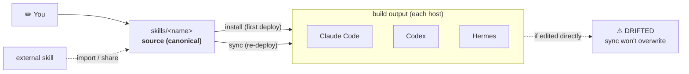

# my-skills

**Write an Agent Skill once. Use it in every agent.**

_One canonical home for your skills — installed, synced, and shared across Claude Code, Codex, and Hermes._

**English** | [한국어](README.ko.md)

[](https://www.python.org/)
[](https://docs.astral.sh/uv/)
[](https://agentskills.io/specification)
[](LICENSE)

`my-skills` is a small CLI that keeps your [Agent Skills](https://agentskills.io/specification)
in a single place and installs the same skill into every AI coding agent you use.
Edit a skill once; `sync` propagates it everywhere — and tells you when a copy has
drifted instead of silently clobbering your work.

## Why

- **Author once, run anywhere** — the same skill works in Claude Code, Codex, and Hermes.
- **No silent overwrites** — installs copy by default and detect local edits (drift) before touching them.
- **Machine-local stays local** — secrets, paths, and accounts never land in a canonical skill or in git.
- **CI-friendly** — `validate`, `install`, and `sync --check` exit non-zero on errors or drift.

## How it works

A skill is just a directory under `skills/<name>/` with a `SKILL.md` that carries
YAML frontmatter (`name`, `description`) — the [Agent Skills](https://agentskills.io/specification)
standard. The `skills/` directory is the **canonical** source of truth.

Each agent (Claude Code, Codex, Hermes) is a **host**. `install` copies a canonical
skill into a host; `sync` keeps those copies up to date. Because copies can be edited
in place, `my-skills` tracks **drift** so a `sync` never overwrites local changes
without telling you.

Think of `skills/` as your source and each host copy as a build output:



## Quick start

Requirements: **Python 3.11+** and [uv](https://docs.astral.sh/uv/).

Install the CLI from GitHub, then create your private registry:

```bash
uv tool install git+https://github.com/Seosiju/my-skills.git

my-skills init-registry        # prompts for a location; default: ~/my-agent-skills
my-skills install --dry-run    # preview seeded default skill installs
my-skills install              # deploy enabled skills into your agents
```

`init-registry` seeds the public-safe default skills, records the registry as
the active root, and initializes git unless you pass `--no-git`. After that,
commands work from any directory:

```bash
my-skills doctor
my-skills skills --json
```

`skills` shows every skill and where it's installed across your hosts:

```text
SKILL             ENABLED  CLAUDE   CODEX    HERMES
----------------  -------  -------  -------  -------
cli-inventory     yes      fresh    fresh    missing
personal-profile  yes      fresh    stale    missing
my-skills         yes      fresh    fresh    fresh
```

## Public CLI, Private Registry

This repository has two jobs:

```text
github.com/Seosiju/my-skills
  public CLI package
  public-safe starter skills
  docs, tests, release automation

your private registry
  my-skills.toml
  skills/<name>/SKILL.md
  private workflows and personal/company skills

machine-local data path
  real config.json files
  accounts, tokens, memory, local state
```

Use the public repo to install the tool. Use a private registry when your
canonical skills contain personal, company, or machine-specific context. Keep
secrets out of both repos; put them under `my-skills data-path <skill>`.

Create a private registry. With no path, the default is `~/my-agent-skills`;
`init-registry` seeds the default public-safe skills and runs `git init`:

```bash
uv tool install git+https://github.com/Seosiju/my-skills.git
my-skills init-registry
```

The scaffold looks like this:

```text
my-agent-skills/
├── my-skills.toml        # hosts, defaults, seeded [skills.<name>] entries
├── skills/               # canonical skills, including seeded defaults
├── .gitignore            # ignores local overrides
└── README.md             # private registry operating notes
```

Pass `--no-defaults` for a blank registry, or `--no-git` if you want a plain
folder with no git repository. `bootstrap` is now a contributor path for editable
source checkouts, not the normal first-run setup.

Add your first private skill:

```bash
mkdir -p skills/my-private-skill
$EDITOR skills/my-private-skill/SKILL.md
```

Then register it in `my-skills.toml`:

```toml
[skills.my-private-skill]
enabled = true
hosts = ["claude", "codex", "hermes"]
```

Preview before writing to agent hosts:

```bash
my-skills validate
my-skills audit --all --json
my-skills install --dry-run
my-skills install
```

## Included skills

| Skill | What it does |
|-------|--------------|
| `cli-inventory` | Discover the CLI tools installed on this machine (PATH + Homebrew/npm/pipx/cargo/gem/pip) and record them to a machine-local inventory you can read back quickly. |
| `personal-profile` | Remembers durable user facts (identity, preferences) and applies them across agents. |
| `my-skills` | Agent-facing skill that guides catalog, share, install, and sync workflows through the CLI. |
| `my-jira` | Disabled-by-default Jira/Atlassian bootstrap skill with a machine-local config template. |

## Everyday commands

```bash
# See what exists and where it's installed.
my-skills skills              # add --json for agents/UIs
my-skills status              # install status per skill and host

# Install / update.
my-skills install --dry-run   # preview the plan, write nothing
my-skills install             # enabled skills -> enabled hosts
my-skills install cli-inventory --host claude
my-skills install cli-inventory --host all --yes  # explicit multi-host write
my-skills sync                # push canonical edits to managed installs
my-skills sync --check        # detect drift only (non-zero exit if not fresh)

# Remove a managed install (recorded destinations only).
my-skills uninstall cli-inventory --host claude

# Turn a skill on/off for default install/sync selection.
my-skills enable cli-inventory
my-skills disable cli-inventory
```

### Bring in a skill you already wrote

```bash
# Import an external skill directory into canonical skills/.
my-skills import ~/.hermes/skills/cli-inventory

# Or review a host's local skills, then promote one into my-skills.
my-skills share --from claude --plan --json
my-skills share --from claude cli-inventory --enable
my-skills sync cli-inventory
```

### Develop a skill live

```bash
# Symlink the host copy to canonical so edits show up without a sync.
my-skills install cli-inventory --host claude --mode link
```

A linked install always reports `FRESH`; `uninstall` removes only the symlink and
never the canonical source. Copy mode is the default.

## How it stays safe

- **Copy by default.** Installs copy the canonical directory; nothing changes until the next `install` or `sync`.
- **Multi-host writes require confirmation.** `--host all` and other multi-host writes
  need `--yes` after you review a dry-run plan. Read-only checks still run without it.
- **Collision = block.** A pre-existing, unmanaged destination is never overwritten.
- **Drift-protected.** A locally edited copy is reported, not clobbered.
- **Atomic writes.** Installs stage to a temp dir and swap into place; failures roll back.

Install state is machine-local (`$XDG_STATE_HOME` or `~/.local/state/my-skills/`)
and never committed.

`sync` and `status` classify each (skill, host) so you always know what a write would do:

| State | Meaning |
|-------|---------|
| `FRESH` | install matches canonical |
| `STALE` | canonical changed; `sync` will update it |
| `DRIFTED` | the install was edited locally; `sync` won't touch it |
| `CONFLICT` | both sides changed — no auto-merge |
| `MISSING` | registered but not installed |
| `UNMANAGED` | a copy exists that my-skills did not install |

`sync` only writes the safe cases; `DRIFTED`, `CONFLICT`, and `UNMANAGED` block with a non-zero exit.

### Machine-local data

Canonical skills never store machine-specific data. Skills that need real local data
(e.g. the `personal-profile` memory) read and write a single shared data root instead:

```bash
my-skills data-path personal-profile          # resolve the path
my-skills data-path personal-profile --create # and create it
```

The data root is machine-local and never committed. Skills that need private
configuration use the same pattern: keep only `config.example.json` in
`skills/<name>/`, then create the real `config.json` under that skill's data
path.

```bash
config_dir="$(my-skills data-path my-jira --create)"
cp skills/my-jira/config.example.json "$config_dir/config.json"
$EDITOR "$config_dir/config.json"
```

Keep machine-specific overrides in `my-skills.local.toml` or `local/`; both are
ignored by git. Do not commit host install copies, state files, account IDs,
tokens, or personal memory.

## Layout

```text
my-skills.toml            # manifest: hosts + skills + defaults
skills/<name>/SKILL.md    # canonical skills
src/my_skills/            # the CLI package
tests/                    # unit + fixture-driven tests
```

The manifest's `enabled` flag controls default selection: a bare `install` / `sync`
targets only `enabled = true` skills; pass `--all` to target every registered skill.

## Tests

```bash
uv run pytest
uv build
```

Release hygiene also expects:

```bash
uv run my-skills doctor
uv run my-skills skills --json
uv run my-skills bootstrap --dry-run
uv run my-skills install my-skills --host hermes --dry-run

uv tool install --force git+https://github.com/Seosiju/my-skills.git
my-skills bootstrap --dry-run
my-skills doctor
my-skills skills --json
my-skills install my-skills --host hermes --dry-run
```

See [docs/release-checklist.md](docs/release-checklist.md) before tagging a
GitHub Release.

## License

[MIT](LICENSE)
