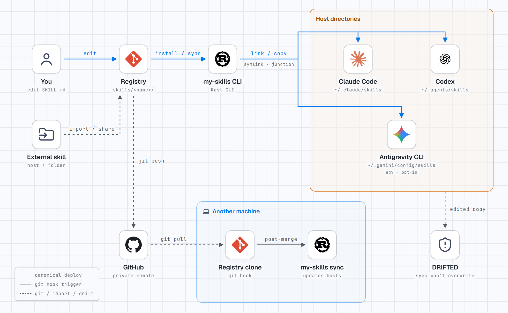

# my-skills

**Write an Agent Skill once. Use it in every agent.**

_One canonical home for your skills — installed, synced, and shared across Claude Code, Codex, Hermes, and Antigravity CLI._

**English** | [한국어](README.ko.md)

[](https://www.rust-lang.org/)
[](https://agentskills.io/specification)
[](LICENSE)

`my-skills` is a small CLI that keeps your [Agent Skills](https://agentskills.io/specification)
in a single place and installs the same skill into every AI coding agent you use.
Edits to a linked skill are visible in each host. For copy installs, `sync`
propagates canonical edits and flags locally edited copies.

## Why

- **Author once, run anywhere** — the same skill works in Claude Code, Codex, Hermes, and Antigravity CLI.
- **Live links by default** — new registries use links, and copy mode detects local edits before replacing a copy.
- **Machine-local stays local** — secrets, paths, and accounts never land in a canonical skill or in git.
- **CI-friendly** — `validate`, `install`, and `sync --check` exit non-zero on errors or drift.

## Antigravity CLI (agy)

AGY is supported **opt-in**. Existing manifests that omit it keep their existing
Claude Code/Codex/Hermes default targets. New registries explicitly disable AGY,
while seeded skills include it in their supported hosts. To enable it, add:

```toml
[targets.agy]
enabled = true
scope = "user"
path = "~/.gemini/config/skills"
```

Include `agy` in each desired skill's `hosts` list. `--host all` selects only
enabled targets; explicit `--host agy` can select a disabled target, just like
other explicit hosts. Use normal validation, audit, and dry-run before migration:

```bash
my-skills doctor --no-update-check
my-skills install <skill> --host agy --dry-run --json
my-skills install <skill> --host agy
my-skills skills --host agy --json
agy -p '/skills' --output-format json
```

The project path is `.agents/skills`. Global-path discovery for both regular
folders and symlinks was verified on macOS with **Antigravity CLI 1.2.16** and again
with **1.5.15**; `/skills` used zero model turns and tokens in that verification. On Windows, `my-skills`
links skills with directory junctions by default, which **Antigravity CLI 1.5.14**
did not discover while regular folders worked. Windows users can set
`install_mode = "copy"` under `[targets.agy]` in `my-skills.local.toml` while
other hosts keep links; `my-skills doctor` warns on Windows when `agy` is
enabled with effective mode `link`, or when recorded `agy` link connections
remain (even if `agy` is disabled or already set to `copy`). On Windows, run
`agy -p '/skills' --output-format json` from PowerShell rather than Git Bash
(Git Bash rewrites `/skills` into a Windows path). This does not validate
Antigravity IDE or every CLI version. Official documentation has also described
`~/.gemini/antigravity-cli/skills`, so recheck discovery on other versions and use
a target path override if needed. Preserve existing unmanaged skills: compare,
back up outside discovery paths, and migrate through the usual collision checks.
Public Hermes support remains unchanged; personal registries may disable it.

## How it works

### One tool, two repos

The tool repo (this repository) is what you install. Your registry (default
`~/my-agent-skills`, created by `init-registry`) is where your skills live.
The source checkout provides the CLI and its public seed files. Keep your registry in a separate directory.

A skill is just a directory under your registry's `skills/<name>/` with a
`SKILL.md` that carries YAML frontmatter (`name`, `description`) — the
[Agent Skills](https://agentskills.io/specification) standard. Your registry's
`skills/` directory is the **canonical** source of truth.

Each agent (Claude Code, Codex, Hermes, Antigravity CLI) is a **host**.
`install` connects canonical skills to hosts using links or copies. `sync`
reconciles configured connections and removes managed installs that are no
longer wanted by default. It protects locally edited copies from overwrites.

The registry's `skills/` directory holds the canonical skills. Host directories
hold links to those skills or copies that the agent can discover.

<picture>
  <source media="(prefers-color-scheme: dark)" srcset="docs/images/how-it-works-dark.png">
  
</picture>

## Install the CLI

The installers download the latest stable binary from GitHub Releases and
verify the archive against `SHA256SUMS`.

### macOS and Linux

For Apple silicon or Intel Macs and x86-64 GNU/Linux:

```bash
curl -fsSL https://raw.githubusercontent.com/Seosiju/my-skills/main/scripts/install.sh -o my-skills-install.sh
sh ./my-skills-install.sh
```

The default install directory is `$HOME/.local/bin`. Add it to PATH if needed,
then run `my-skills --version`.

### Windows

From PowerShell on x86-64 Windows:

```powershell
Invoke-WebRequest -Uri 'https://raw.githubusercontent.com/Seosiju/my-skills/main/scripts/install.ps1' -OutFile '.\my-skills-install.ps1'
.\my-skills-install.ps1 -AddToPath
my-skills --version
```

The default install directory is `%LOCALAPPDATA%\Programs\my-skills\bin`.
`-AddToPath` adds it to your user PATH and the current PowerShell session.

For a specific release, set `MY_SKILLS_VERSION` to its tag before running the
installer. If another `my-skills` is already installed, check that PATH selects
the new binary. See [CONTRIBUTING.md](CONTRIBUTING.md) for source builds.

Terminals and agent sessions that were already open keep their old PATH. Open
a new one after installing, especially before running Git in your registry, so
the hooks do not pick up an older `my-skills`.

## Quick start

After installing the CLI, run the following from outside the tool repo:

```bash
my-skills init-registry        # prompts for a location; default: ~/my-agent-skills
my-skills doctor               # confirm the Registry line points at your registry
my-skills install --dry-run    # preview seeded default skill installs
my-skills install              # deploy enabled skills into your agents
```

`init-registry` seeds the public-safe default skills, records the registry as
the active root, and initializes git unless you pass `--no-git`. After that,
commands work from any directory:

```bash
my-skills doctor
my-skills skills --json
```

`skills` shows every skill and where it's installed across your hosts:

```text
SKILL             ENABLED  CLAUDE   CODEX    HERMES
----------------  -------  -------  -------  -------
cli-inventory     yes      fresh    fresh    missing
my-skills         yes      fresh    fresh    fresh
```

## Updating the CLI

In Python v0.4.2, run `my-skills update` for the Rust migration instructions.
The Python command prints the installer links for a stable v1 release.
See the [v0.4.2 changelog entry](CHANGELOG.md#042---2026-11-23).

The Rust CLI's `my-skills doctor` checks for a newer stable v1 release. Run
`my-skills update` to install it. The updater verifies the archive checksum
and replaces the executable you ran.

```bash
my-skills doctor
my-skills update
```

Use `--check` to check for an update or `--dry-run` to preview the downloads
and executable replacement for a newer release:

```bash
my-skills update --check
my-skills update --dry-run
```

`--channel main` chooses the highest version among published releases,
including prereleases:

```bash
my-skills update --channel main
```

## Public CLI, Private Registry

This repository has two jobs:

```text
github.com/Seosiju/my-skills
  public CLI package
  public-safe starter skills
  docs, tests, release automation

your private registry
  my-skills.toml
  skills/<name>/SKILL.md
  private workflows and personal/company skills

machine-local data path
  real config.json files
  accounts, tokens, memory, local state
```

Use the public repo to install the tool. Use a private registry when your
canonical skills contain personal, company, or machine-specific context. Keep
secrets out of both repos; put them under `my-skills data-path <skill>`.

Create a private registry. With no path, the default is `~/my-agent-skills`;
`init-registry` seeds the default public-safe skills, records the active root,
and runs `git init`:

```bash
my-skills init-registry
```

The scaffold looks like this:

```text
my-agent-skills/
├── my-skills.toml        # hosts, defaults, seeded [skills.<name>] entries
├── skills/               # canonical skills, including seeded defaults
├── .gitignore            # ignores local overrides
└── README.md             # private registry operating notes
```

Pass `--no-defaults` for a blank registry, or `--no-git` if you want a plain
folder with no git repository. On another machine, clone an existing registry
and run `my-skills bootstrap` from that clone to reconcile its host connections.
Run `my-skills hooks install` separately to set up its Git hooks (see
[Keep every machine in sync](#keep-every-machine-in-sync)).

## Where commands look for your registry

Most commands resolve a registry in this order:

1. `MY_SKILLS_ROOT` environment variable, for a one-command override.
2. `my-skills.toml` in the current directory or one of its parents, for that
   command only.
3. The cached active root written by `init-registry` or `set-root`.

If you run a command inside one registry while another valid active root is
cached, the command uses the current directory for that invocation and prints a
note to stderr; it does not silently repoint the active root. To switch
permanently, run:

```bash
my-skills set-root /path/to/your/registry
my-skills doctor
```

On a machine with no active root yet, first-run discovery from the current
directory can record that registry for convenience. A `--dry-run` never records
it; the preview prints `would remember <path> as the active registry` instead. Contributor clones also
contain seed `skills/` and `my-skills.toml` files for packaging and tests, so
use `my-skills doctor` and check the `Registry:` line before making real skill
changes.

Add your first private skill:

```bash
mkdir -p skills/my-private-skill
$EDITOR skills/my-private-skill/SKILL.md
```

Then register it in `my-skills.toml`:

```toml
[skills.my-private-skill]
enabled = true
hosts = ["claude", "codex", "hermes", "agy"]
```

Validate the registry and review the install plan for the new skill before
confirming the write to multiple hosts.

```bash
my-skills validate
my-skills audit --all --json
my-skills install my-private-skill --dry-run
my-skills install my-private-skill --yes
```

## Keep every machine in sync

Your registry is a Git repository. Push it to a private remote, clone it on each
machine, and install the Git hooks once per clone:

```bash
my-skills hooks install
my-skills hooks status
```

- `pre-commit` validates the skills and manifest changes in the commit and blocks
  a broken skill.
- `post-merge`, `post-rewrite`, and `post-checkout` (branch switches) run `sync`,
  so a `git pull` connects new skills, updates copies, and removes disabled ones
  on every host of that machine.
- With links, an edit to a canonical skill is visible to every agent on the same
  machine right away. Commit and push it to share it with your other machines.

The hooks call `my-skills` from PATH and fall back to the binary path recorded by
`hooks install`. Rerun `my-skills hooks install` if you move the binary. A sync
failure in a hook prints a warning but does not fail the Git command, so run
`my-skills status` if a pull looks incomplete.

## Included skills

| Skill | What it does |
|-------|--------------|
| `cli-inventory` | Discover the CLI tools installed on this machine (PATH + Homebrew/npm/pipx/cargo/gem/pip) and record them to a machine-local inventory you can read back quickly. |
| `my-skills` | Agent-facing skill that guides catalog, share, install, and sync workflows through the CLI. |
| `my-jira` | Disabled-by-default Jira/Atlassian bootstrap skill with a machine-local config template. |

`personal-profile` is no longer bundled. The default set applies to newly
initialized registries. Updating the CLI package does not delete skills in a
separate personal registry, host installations, or machine-local data. Pulling
this tool repo does update its bundled seed sources; keep personal skills in a
separate registry.

If your registry still registers `personal-profile`, disable it before removing
host copies so a later `install` or `sync` does not restore them:

```bash
my-skills disable personal-profile
my-skills uninstall personal-profile --host <host>
```

If the skill is already unregistered, run only `uninstall`; it can remove
previously managed copies using the install state.

## Everyday commands

```bash
# See what exists and where it's installed.
my-skills skills              # add --json for agents/UIs
my-skills status              # install status per skill and host

# Install / update.
my-skills install --dry-run   # preview host changes
my-skills install             # enabled skills -> enabled hosts
my-skills install cli-inventory --host claude
my-skills install cli-inventory --host all --yes  # explicit multi-host write
my-skills sync --dry-run      # preview changes including removals
my-skills sync --yes          # reconcile the reviewed plan across enabled hosts
my-skills sync --check        # non-zero if reconciliation needs changes or is blocked

# Remove a managed install (recorded destinations only).
my-skills uninstall cli-inventory --host claude

# Turn a skill on/off in the manifest.
my-skills enable cli-inventory
my-skills disable cli-inventory
```

### Bring in a skill you already wrote

```bash
# Import an external skill directory into canonical skills/.
my-skills import ~/.hermes/skills/cli-inventory
my-skills enable cli-inventory
my-skills install cli-inventory --host <host>

# Or register it as enabled immediately.
my-skills import ~/.hermes/skills/cli-inventory --enable

# Or promote a Claude Code skill that is new to the registry.
my-skills share --from claude --plan --json
my-skills share --from claude example-skill --enable
my-skills sync example-skill --dry-run
my-skills sync example-skill --yes
```

`import` registers the skill in `my-skills.toml` automatically. By default the
new entry is disabled; pass `--enable` or run `my-skills enable <skill>` before
installing it. Import sources that contain symlinks are rejected so the audit
and copy boundaries stay the same directory tree.

### Develop a skill live

```bash
# Link the host directory to the canonical skill so edits show up immediately.
my-skills install cli-inventory --host claude --mode link
```

Link mode uses a symlink on Unix and prefers a junction on Windows. Uninstalling a
managed link removes the link while leaving its target in the registry. You can
override `install_mode = "link" | "copy"` per host under `[targets.<host>]` in
`my-skills.toml` or `my-skills.local.toml` (precedence for new connections:
`install --mode` > `[targets.<host>] install_mode` > `[defaults] install_mode`).
Existing installs retain their recorded mode. Use `my-skills convert --to link`
with `--dry-run` to preview converting existing copies; `convert --to <mode> --host all`
skips hosts whose explicit `[targets.<host>] install_mode` differs from `--to`,
while an explicit `--host <name>` still converts as requested.

## How it stays safe

- **Link by default.** Set `install_mode = "copy"` under `[defaults]` or
  `[targets.<host>]` in `my-skills.toml` / `my-skills.local.toml`, or pass
  `--mode copy` to `install` to create new copies.
- **Multi-host writes require confirmation.** Review a dry run before running
  `install` or `sync` with `--yes` across multiple hosts. A plain `install` of
  only built-in seeds at default host paths is exempt.
- **Collision = block.** A pre-existing, unmanaged destination is never overwritten.
- **Drift-protected.** A locally edited copy is reported, not clobbered.
- **Atomic writes.** Installs stage to a temp dir and swap into place; failures roll back.
  That includes a failed save of the install state, so rerunning the same command
  after fixing the cause succeeds.

Install state is machine-local (`$XDG_STATE_HOME` or `~/.local/state/my-skills/`)
and never committed.

`sync` and `status` classify each (skill, host) so you always know what a write would do:

| State | Meaning |
|-------|---------|
| `FRESH` | install matches canonical |
| `STALE` | canonical changed since the copy was installed |
| `DRIFTED` | the install was edited locally; `sync` won't touch it |
| `CONFLICT` | both sides changed — no auto-merge |
| `MISSING` | registered but not installed |
| `UNMANAGED` | a destination exists without a managed install record |
| `BROKEN` | a managed link points at a missing canonical directory |
| `UNSUPPORTED` | the skill's host list excludes this host |

When `sync` tries to connect a wanted skill, `DRIFTED`, `CONFLICT`,
`UNMANAGED`, and `BROKEN` block that connection and produce a non-zero exit.

### Machine-local data

Canonical skills never store machine-specific data. Skills that need real local data
(e.g. `cli-inventory` scan results) read and write a single shared data root instead:

```bash
my-skills data-path cli-inventory          # resolve the path
my-skills data-path cli-inventory --create # and create it
```

The data root is machine-local and never committed. Skills that need private
configuration use the same pattern: keep only `config.example.json` in
`skills/<name>/`, then create the real `config.json` under that skill's data
path.

```bash
config_dir="$(my-skills data-path my-jira --create)"
cp skills/my-jira/config.example.json "$config_dir/config.json"
$EDITOR "$config_dir/config.json"
```

Keep machine-specific overrides in `my-skills.local.toml` or `local/`; both are
ignored by git. Do not commit host install copies, state files, account IDs,
tokens, or personal memory.

## Layout

### Repository layout (the CLI project)

```text
my-skills.toml            # dev/test manifest for this CLI project
skills/<name>/SKILL.md    # public seed sources embedded in the binary
Cargo.toml                # Rust package manifest
src/                      # Rust library and CLI
tests/                    # unit + fixture-driven tests
```

The `skills/` directory in this repository is seed source and a dev fixture for
tests/CI. It is not your registry.

### Your registry layout

```text
my-agent-skills/
├── my-skills.toml
├── skills/<name>/SKILL.md
├── .gitignore
└── README.md
```

By default, `install` connects enabled skills. A bare `sync` also considers
disabled and unregistered skills so it can remove their managed installs.
Use `sync --no-prune` to skip removals. Pass `--all` to `install` or `sync` to
include disabled skills among the connections to make.

## Tests

```bash
cargo fmt --all --check
cargo clippy --all-targets -- -D warnings
cargo test --all-targets
cargo build --release
```

Run the CLI from the working tree. Use a test registry and test host paths for
smoke checks.

```bash
cargo run -- doctor --no-update-check
cargo run -- skills --json
cargo run -- bootstrap --dry-run
cargo run -- install my-skills --host hermes --dry-run
```

See [docs/release-checklist.md](docs/release-checklist.md) before tagging a
GitHub Release.

## License

[MIT](LICENSE)
